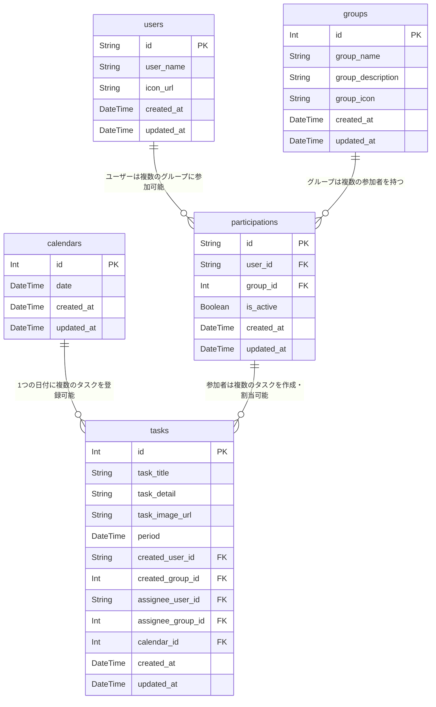

# FastShare
| | |
|:---:|:---:|
|  |  |

## 概要
FastShareは、グループを作成し、メンバー同士でタスク(買い物や家事)を共有できるアプリです。

## 作成の経緯・詳細
お風呂掃除中に洗剤が切れていることに気づき、外出中の家族に購入を依頼しようとしました。ところが、複数の家族にそれぞれ連絡するのは面倒ですし、一人が「買ってくるよ」と承諾した場合には、もう一方に「大丈夫になった」と連絡して断る必要があります。

さらに、買い物が複数アイテムにわたる場合には、この「誰が何を買うのか」を逐一調整する手間が増えてしまいます。また、「さっき買い物に行ったのに、必要なものを伝えそびれてしまった」ということも起こりがちで、必要な情報を事前に整理・共有しておけば良かったと後悔する場面もあります。

こうした課題を解決するために、「必要なもの」を一元的に共有できる仕組みがあれば便利だと考えました。全員がアクセスできる場所に、買うべきアイテムのリストをまとめておけば、それぞれが外出先で確認し、ついでに購入することができます。これにより、

・個別に連絡する手間が省ける 
・重複購入を防止できる 
・「あ、伝え忘れてた！」といったミスを減らせる

ただし、既存のLINEグループなどを利用すると、ほかのトークで埋もれてしまったり、情報が整理されにくいといったストレスが生じたりする場合があります。そこで、ユーザー体験（UX）を最適化した専用のアプリを作成することで、ストレスなく「必要なもの」を管理・共有できるようにしました。

このように、家族や仲間内で買い物を共有・管理できる仕組みを整えることで、重複購入や連絡漏れの問題を解消し、時間をより有意義に使えるようになります。

FastShareは、こうした日常のちょっとした煩わしさをなくすためのソリューションとして開発したものです。

## URL
URL: https://fastshare.jp/login 
※現状ルートURLは何も設定しておらず、白飛びしてしまいますので、/login または　/signupで検索してください。

## 機能一覧
* サインアップ 
* ログイン・ログアウト(google、パスワード・email) 
* プロフィール編集 
* グループ作成、編集、削除

2025-1/24時点
## 実装予定機能
  1. タスクCRUD（実装中...）
  2. グループ招待
  3. Spinnerの実装
  4. Snackbarの作成
## 使用技術
- フロントエンド
  - React
  - TypeScript
  - Material UI
  - Firebase Authentication
  - Vite
- バックエンド
  - Node.js 
  - Express
  - Prisma
  - TypeScript
  - Firebase Admin SDK
  - Docker / Docker Compose
  - Multer-S3（画像アップロード）
- インフラストラクチャ
  - AWS
    - フロントエンド: S3, CloudFront
    - バックエンド: ECS (Fargate), ECR, S3
    - データベース: RDS (MySQL)
  - CI/CD
    - GitHub Actions (フロントエンド)
    - AWS Copilot CLI (バックエンド)
- 開発ツール
  - Git/GitHub
  - Figma

## UIプロトタイプ
[プロトタイプ](  https://www.figma.com/proto/owXvBVTldegJC01y0D0bce/%E3%83%9D%E3%83%BC%E3%83%88%E3%83%95%E3%82%A9%E3%83%AA%E3%82%AA%E8%A8%AD%E8%A8%88?node-id=10-4&t=u7yScyvT6wpmj2fp-1) 

## ER図

## インフラ構成

 

